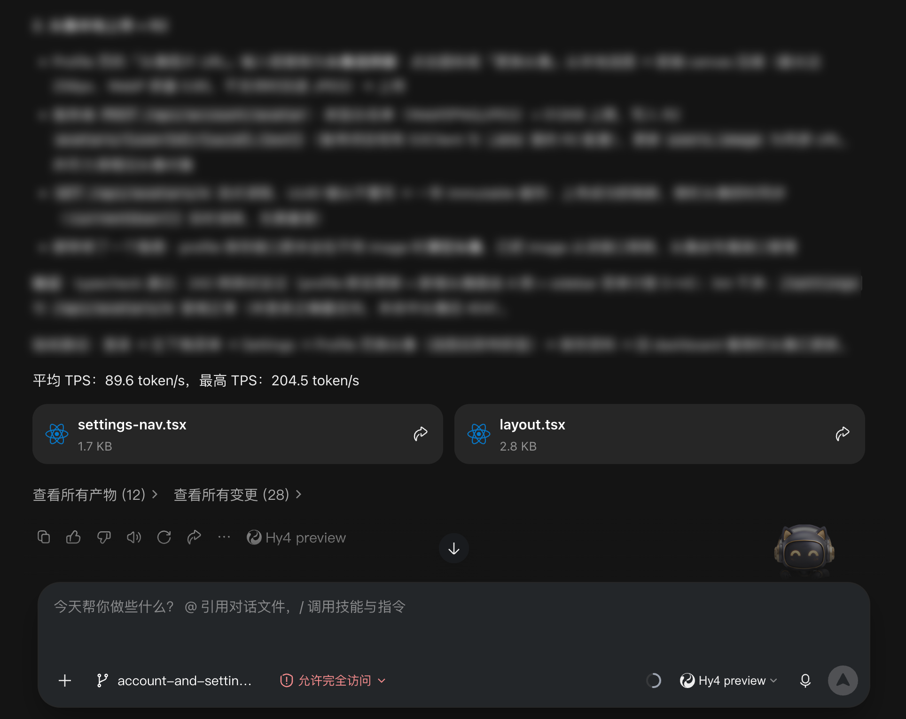

# tps-report · Codex / WorkBuddy 技能

[English](README.md) | **简体中文**

在每个任务结束时，统计本任务内所有大模型请求的 TPS（每秒输出 token 数），
并在最终回复末尾输出一行汇总。支持 Codex 与 WorkBuddy ：

```
平均 TPS：xxx token/s，最高 TPS：xxx token/s
```



## 特性

- **无需手动操作**：安装并写入常驻规则后，每个任务结束都会**自动触发**，
  汇总行自动附在最终回复末尾；也可以随时主动问「刚才 TPS 多少」。
- **不编造**：任何一次调用缺少 token 数或耗时就跳过；一条有效数据都没有时
  原样输出降级提示，绝不估算。
- **一行输出**：汇总只占最终回复最后一行，最多附一句异常提示
  （慢调用 / 低于近 10 天中位水平）。
- **加权平均**：平均 TPS = Σtoken ÷ Σ秒，避免短调用拉高整体。

## 安装

——把下面这句话复制给 Agent 发送即可，剩下的（下载文件、写入 MEMORY.md、验证）由它自动完成：

```
请帮我安装 tps-report 技能： https://github.com/MartianC/tps-report, 按要求初始化并验证安装。
```

在 Codex 中，将此目录放入 `$CODEX_HOME/skills/tps-report/`（默认
`~/.codex/skills/tps-report/`）即可。Codex transcript 会自动从
`~/.codex/sessions/` 探测，无需写入 `MEMORY.md`；手动验证命令与 WorkBuddy 相同：

```bash
python3 scripts/tps_task.py --agent codex --cwd "$(pwd)" --verbose
```

## 用法

**日常无需任何手动操作**——技能常驻后，每次任务结束都会自动统计并汇报。
以下命令仅用于手动验证、排障或主动查询：

`--agent` 为必填参数：Codex 传 `codex`，WorkBuddy 传 `workbuddy`；脚本不会自动在两种环境间切换。

```bash
# 常规：输出一行汇总
python3 scripts/tps_task.py --agent codex --cwd "$(pwd)"

# 排障 / 用户追问：逐次明细（走 stderr，不污染汇总行）
python3 scripts/tps_task.py --agent codex --cwd "$(pwd)" --verbose

# 结构化输出
python3 scripts/tps_task.py --agent codex --cwd "$(pwd)" --json

# 会话记录推导的每请求固定开销（秒），默认 0.35，其他环境可调
python3 scripts/tps_task.py --agent codex --cwd "$(pwd)" --overhead 0
```

## 统计口径

| 项 | 定义 |
|---|---|
| TPS（单次） | `completion_tokens ÷ duration(秒)` |
| 平均 TPS | `Σ completion_tokens ÷ Σ duration`（按 token 加权） |
| 最高 TPS | 单次请求 TPS 的最大值 |
| 单位 | token/s，保留 1 位小数 |

## 兼容性

在 macOS + WorkBuddy 2.137.1 与 Codex Desktop rollout transcript 上实测。数据目录结构变化时脚本以降级提示结束，
不会报错。口径、边界与常驻规则详见 [SKILL.md](SKILL.md)。
